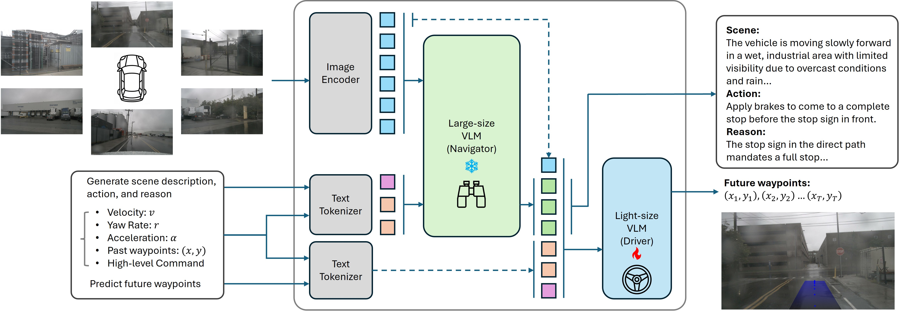

# NaviDriveVLM: Decoupling High-Level Reasoning and Motion Planning for Autonomous Driving
## Overview
Overview of NaviDriveVLM. The system is decoupled into two modules, the Navigator and the Driver. The Navigator is a large-scale VLM responsible for scene understanding and high-level reasoning. The Driver is a lightweight VLM, which enables efficient fully supervised fine-tuning (SFT) as a driving expert for future waypoint prediction.

<!--  -->


## Requirements
We can create a [conda](https://docs.conda.io/en/latest/) environment named `navidrive`:
``` bash
conda create -n navidrive python=3.10
```
Then activate the environment and install required libraries:
``` bash
conda activate navidrive
```
Install [PyTorch](https://pytorch.org/get-started/locally/) based on your GPU:
``` bash
pip install torch torchvision --index-url https://download.pytorch.org/whl/cu126
```
Install other libraries:
``` bash
pip install transformers==5.1.0 accelerate==1.12.0 peft==0.18.1 "bitsandbytes>=0.46.1" opencv-python==4.11.0.86 nuscenes-devkit qwen-vl-utils
```
- Flash-attention
FlashAttention is optional in the configuration YAML file. If you would like to enable it, please follow the FlashAttention [README](https://github.com/Dao-AILab/flash-attention?tab=readme-ov-file#installation-and-features) for installation instructions.

## Dataset
The `data` folder already includes several pairs of `.jsonl` files used for training and evaluation, generated from the nuScenes dataset.

- `nuscenes_reasons_Qwen_32B` and `nuscenes_reasons_val_Qwen_32B` are generated by `Qwen3-VL-32B-Instruct`.
- `nuscenes_reasons_Qwen_8B` and `nuscenes_reasons_val_Qwen_8B` are generated by `Qwen3-VL-8B-Instruct`.
- `nuscenes_reasons_Gemini` and `nuscenes_reasons_val_Gemini` are generated by `Gemini-2.5-Flash`.

If you would like to generate reasoning data from the nuScenes dataset, run the following command:
``` bash
pyhotn3 naviGen_Qwen.py --model_id Qwen/Qwen3-VL-32B-Instruct --output_file data/nuscenes_reasons_Qwen_32B.jsonl --data_path /PATH/TO/NUSCENES/DATASET --version v1.0-trainval --is_train 0
```
Arguments:
- **`--model_id`**: Model ID from Hugging Face.
- **`--output_file`**: Path to the output `.jsonl` file.
- **`--data_path`**: Path to your nuScenes dataset.
- **`--version`**: nuScenes dataset version (`v1.0-trainval` or `v1.0-mini`).
- **`--is_train`**: Dataset split selector  
  - `0`: training set
  - `1`: validation set  

Metadata Format:
``` json
{
  "token": ["token"],
  "wp_past": "(x, y, \theta) x t_p",
  "wp_future": "(x, y, \theta) x t_f",
  "vel_val": "<float: current_vel>",
  "acc_val": ["<float: a_x>", "<float: a_y>"],
  "yr_val": "<float: current_yaw>",
  "action_past": "(a, kappa) x (t_p - 1)",
  "action_future": "(a, kappa) x t_f",
  "image_paths": ["str x 6"],
  "reasons": ["str x 1"]
}
```
## Training Models
Run `train.py` to train a model. It only requires one argument: `--config`.
``` bash
python3 train.py --config configs/default.yaml 
```
Configuration files are stored in the `configs` folder. Key arguments include:

- **`model_id`**: Model ID from Hugging Face.
- **`attention`**: Attention implementation. `flash_attention_2` requires installing FlashAttention separately.
- **`quantization`**: Whether to use a quantized model.
- **`enable_action`**: Whether to convert waypoints `(x, y)` to control actions `(\alpha, \kappa)`.
- **`enable_image`**: Whether to include image inputs.
- **`enable_reason`**: Whether to include reasoning inputs.

## Inference
After training a model, you can run the following command to perform inference. 
The predicted waypoints will be saved in `results/inference` for further evaluation.
``` bash
python3 eval.py --config configs/default.yaml --inference_path data/nuscenes_reasons_val_Qwen_32B.jsonl
```
## Evaluation
### L2 Error
To evaluate the L2 error:
``` bash
python3 eval.py --config configs/default.yaml --eval_L2 True
```
The results will be stored in `results`.
### Video Generation
To generate a visualization video, specify the start and end indices of the frames using `--start_idx` and `--end_idx`:
``` bash
python3 eval.py --config configs/default.yaml --eval_video True --start_idx 0 --end_idx 2000
```
The generated video will be stored in `results/videos`.
